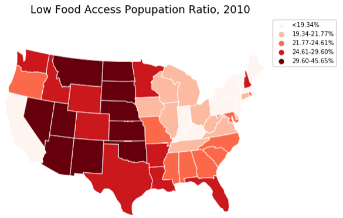
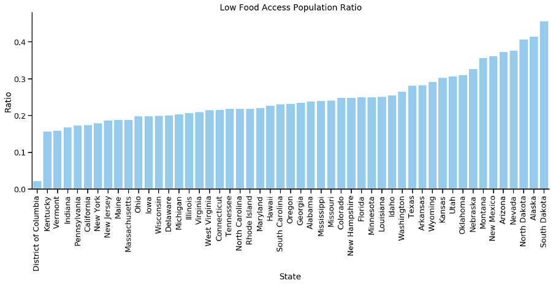
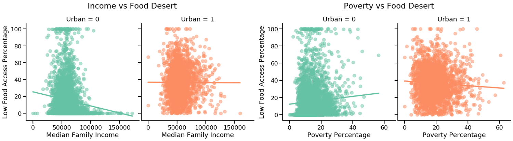
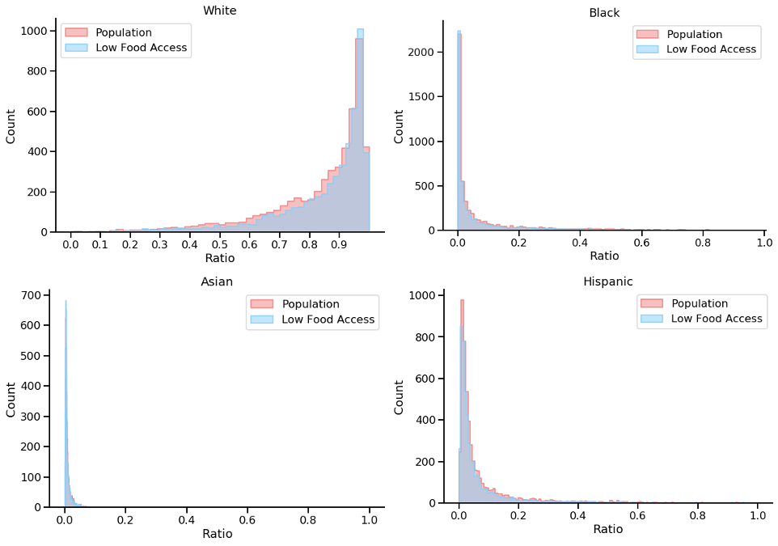
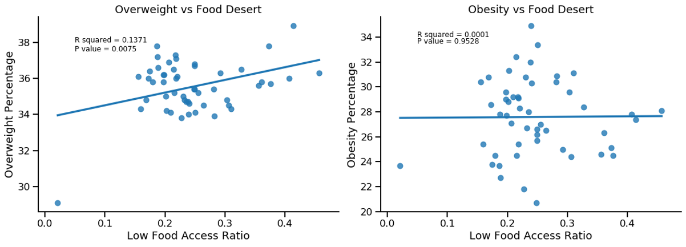

# DATA 512 Final Project

## Abstract 
For the final project of the class, I studied food access in the United States by looking at the prevalence of food deserts and whom they affect the most, as well as the relationship between food access and physical health. I found out that on average, over 20% of the people in each state are affected by low food access and it can potential increase people's risk of becoming obese.

Please see [DATA-512-Final-Project.ipynb](https://github.com/ruiany/data-512/blob/main/data-512-final/DATA-512-Final-Project.ipynb) for the full report and code used in this project.

## Requirement
#### Programming language:
- Python version 3.0 and above

#### Packages:
- NumPy 1.11.1
- pandas 1.0.4
- matplotlib 1.5.3
- geopanda 0.7.0
- plotly 4.8.1
- notebook 6.0.3
- seaborn 0.11.0
- scipy 1.4.1

## Data
#### Raw
The datasets I used are the US food access data from the [Food Access Research Atlas](https://www.ers.usda.gov/data-products/food-access-research-atlas/) and the Nutrition, Physical Activity, and Obesity - Behavioral Risk Factor Surveillance System from the [Centers for Disease Control and Prevention (CDC)](https://chronicdata.cdc.gov/Nutrition-Physical-Activity-and-Obesity/Nutrition-Physical-Activity-and-Obesity-Behavioral/hn4x-zwk7). The Food Access Research Atlas dataset is released under a Creative Commons CC Zero License (cc-zero) and the CDC dataset is under a Public Domain license. Both datasets allow public use. 

The first dataset contains information on supermarket access at various distances depending on if the neighborhood is rural or urban. It also combines food access data with other fields such as age, race, and income. The second dataset contains data on adult's diet, physical activity, and weight status from Behavioral Risk Factor Surveillance System, which provides national and state specific data on obesity, nutrition, physical activity, and breastfeeding. I'm hoping to join the two datasets by geographic information and see if there's any correlation between food access and physical health measured by obesity rate. 
#### Final
The final cleaned data used for analysis and visualization can be found in [data/final](https://github.com/ruiany/data-512/tree/main/data-512-final/data/final)
The resulting food_access_health_merge.csv file will have the following schema:
index	GeoLocation	LocationAbbr	LocationDesc	Question	Data_Value	State	la_ratio
Column | Format | Description |
|-----|------------|----|
index | Int | The unique census tract identifier |
GeoLocation | Object | Lattitude and longitude of the state |
LocationAbbr| String | State abbreviation |
LocationDesc | String | State full name |
Question | String| Health survey question |
Data_Value | Float | The percentage of people who answer 'yes' to the survery question |
State | String | State name | 
la_ratio | Float | The percentage of people who suffer from low food access |

## Conclusions
#### Food desert is especially severe in the midwest and the west of the US.

#### Low income people were more susceptible to low food access in rural areas.

#### No detectable bias for food access between different races, though the race ratio in the dataset was biased.

#### There is a weak correlation between people who live food deserts and people who are overweight.

## License

The MIT License is a permissive free software license originating at the Massachusetts Institute of Technology (MIT). As a permissive license, it puts only very limited restriction on reuse and has therefore an excellent license compatibility. For detailed description of the contents of license please refer to the file [License](https://github.com/ruiany/data-512/blob/main/data-512-final/LICENSE).

